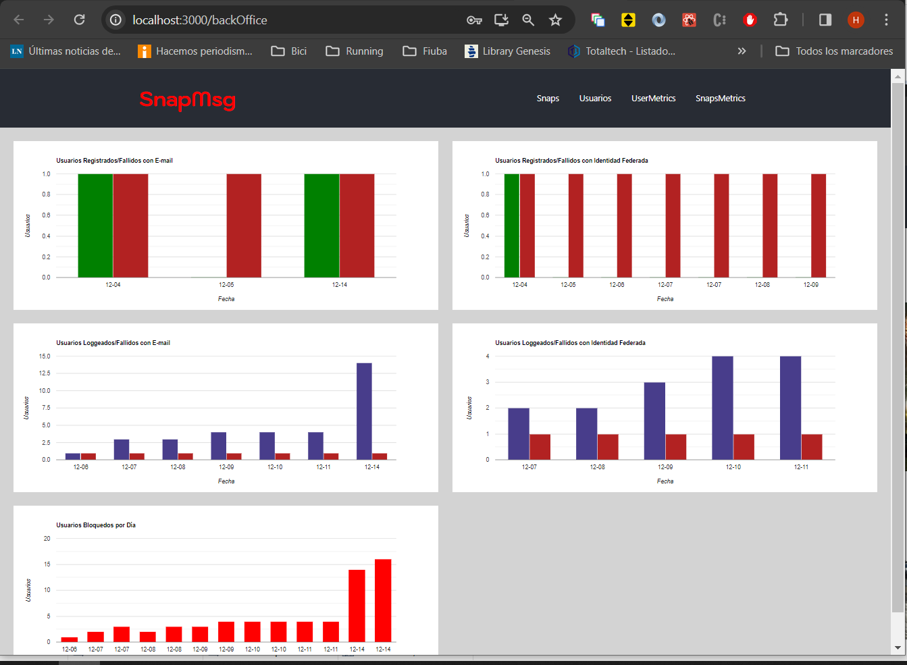

# SnapMsg BackOffice

Deployed at [GitHub Pages](https://taller2fiuba-g6.github.io/backOffice/)

# Login

-   Para Ingresar al Backoffice el Usuario debe tener permisos de "Administrador. El mismo solo puede ser otorgado por otro Administrador

# Administración de SnapMsgs

-   Lista la totalidad de Snap Messages creados en el sistema. En la pestaña principal se listan:
    -   Fecha y Hora de Creación.
    -   Nombre del Usuario creador.
    -   Texto del SnapMsg.
    -   Indicativo de si posee imágenes.
    -   Botón para Bloquer/Desbloquear el Mensaje.
-   Al seleccionar un SnapMsg, en la Pestaña secundaria se muestra:
    -   Texto del SnapMsg.
    -   Imagen Cargada.

# Administracion de Usuarios

-   Indica:
    -   Si el usuari es adminstrador(pemite cambiarlo).
    -   Nombre de Usuario.
    -   Descripción Ingresada por el Usuario.
    -   Locación Ingresada por el Usuario.
    -   Permite bloquearlo.
-   En la pestaña secundaria se Muestran:
    -   Foto de Pantalla de Usuario.
    -   Foto de Perfil.

# Metrics de Usuarios

-   Informa Métricas sumarizadas por día para:
    -   Usuarios Registrados usando Email/Password.
    -   usuarios Registrados mediante "Identidad Federada" (google).
    -   Logins de Usuarios usando Email/Password.
    -   Logins de Usuarios usando "Identidad Federada"
    -   Usuarios bloquedos por un Administrador durante el Día.

